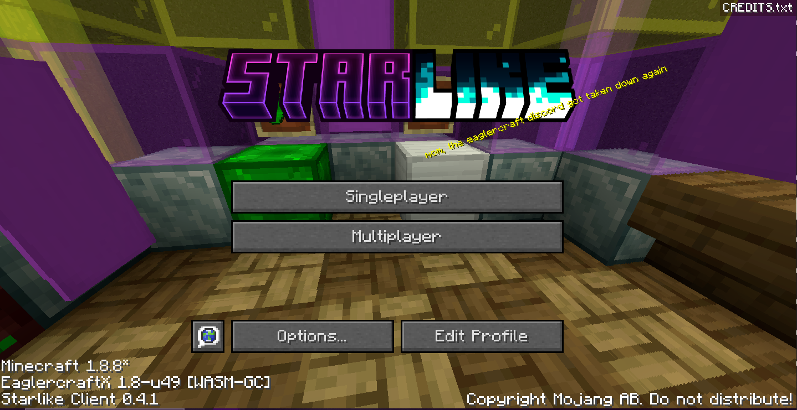
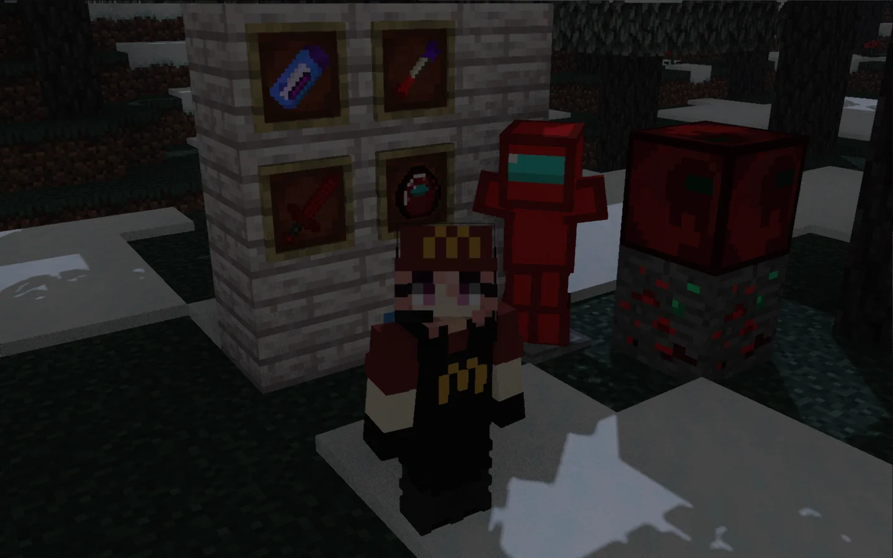
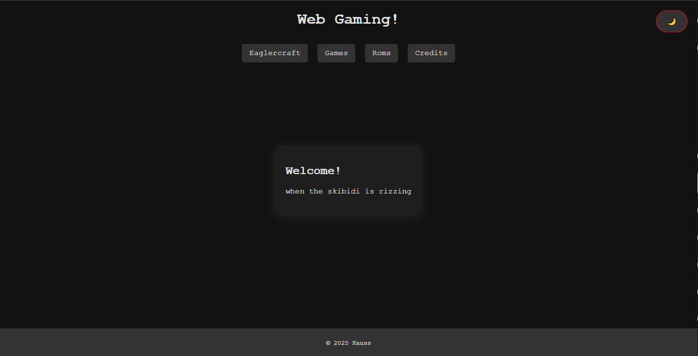

## Some projects I work on 

- **Starlike Client**: https://git.webmc.xyz/starlike-client

- **Sigma Client**: https://sigmaclient.site

- **Kauss's Games**: https://games.kauss.lol

---

## Languages I know

 - **Javascript (css and html)**
 - **PHP**: enough to get by lol
 - **Java**: only know a little, though not much is needed for minecraft modding. 

---

## What I like

 - eaglercraft is pretty cool, so i take interest in working on clients for that.
 - chicken sandwiches are nice
 - homebrewing is my jam, hardware modding too. 
 - 
